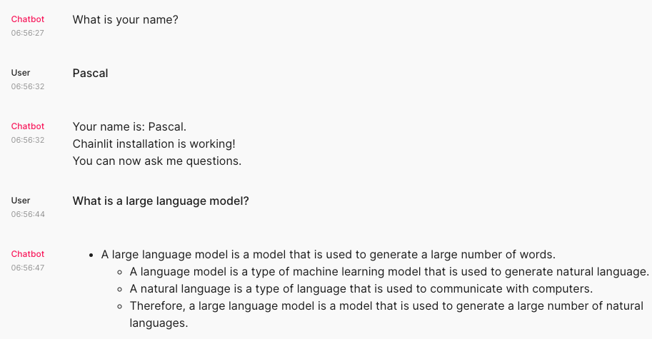

# Langchain Falcon LLM Chainlit (LFLC)

I am just playing around with the Falcon LLM implementation. This is not a serious project but you can use it as a starting point for your own project.
Falcon LLM is one of the top open LLM that can be used today according to [Hugging Face Open LLM Leaderboard](https://huggingface.co/spaces/HuggingFaceH4/open_llm_leaderboard).




## For Developers
```bash
brew install pre-commit
pre-commit install --hook-type commit-msg
```

## Installation
```bash
poetry install
```

## Exemplary Usage
```bash
poetry shell
chainlit run chatbot.py
```

Have some fun with the chatbot. It is not very smart but it is a start for a more sophisticated chatbot.
